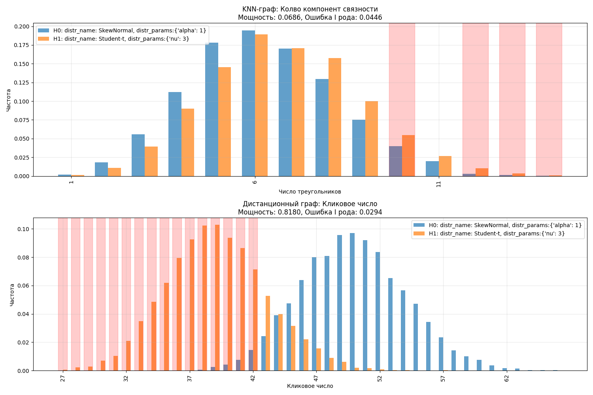

# Отчёт по работе

## Часть 1 — Влияние параметров распределения

| Серия | График |
|-------|--------|
| **Аскар** |  |
| **Ярослав** |  |

**Выводы Аскара**

* Параметр `α` SkewNormal почти не меняет число компонент k-NN-графа (≈ 6.0 – 6.7).  
* При росте `ν` у Student-t число компонент сокращается, а кликовое число dist-графа растёт.  
* Чем тяжелее хвосты, тем ниже кликовое число.

**Выводы Ярослава**

* `λ` Weibull мало влияет на треугольники; `σ` Lognormal уменьшает их почти на 40 %.  
* В dist-графе `λ` обратно пропорционален, а `σ` почти не влияет на кликовое число.

---

## Часть 2 — Влияние $n$, $k$ и $d$

| Серия | График |
|-------|--------|
| **Аскар** |  |
| **Ярослав** |  |

**Ключевые выводы**

* **Объём $n$** — метрики растут почти линейно; кликовое число — быстрее остальных.  
* **Соседи $k$** — при $k ≥ 10$ k-NN-граф становится связным ⇒ чувствительность падает.  
* **Порог $d$** — кликовое число растёт линейно; выбор $d$ критичен.

---

## Часть 3 — Проверка гипотез

| График | Описание |
|--------|----------|
|  | Askar: $H_0$ vs $H_1$ (первый набор) |
|  | Yaroslav: $H_0$ vs $H_1$ (первый набор) |
|  | Askar: критическая область (второй набор) |
|  | Yaroslav: критическая область (второй набор) |

| Сценарий | Метрика | Мощность | $\alpha$ |
|-----------|---------|----------|----------|
| Askar | Компоненты (k-NN) | **0.013** | 0.007 |
|  | Клика (dist) | **0.968** | 0.046 |
| Yaroslav | Треугольники (k-NN) | **0.105** | 0.043 |
|  | Клика (dist) | **0.969** | 0.041 |

**Главные выводы**

* Кликовое число dist-графа обладает наибольшей мощностью (≈ 0.97).  
* Метрики k-NN-графа (компоненты, треугольники) существенно слабее.  
