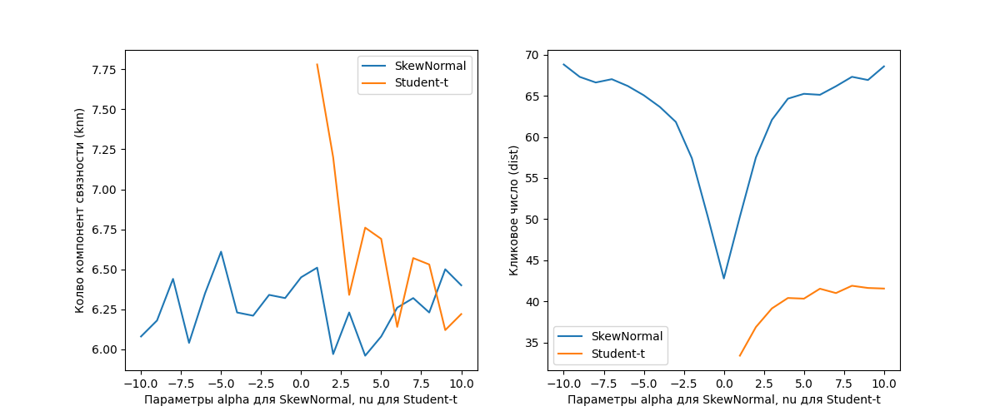
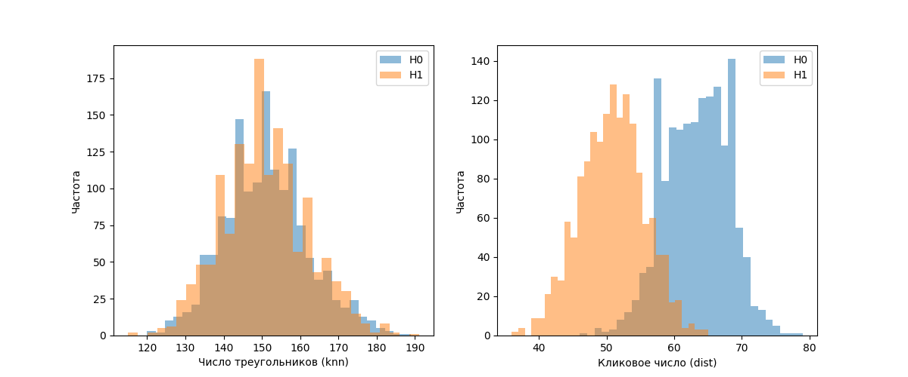
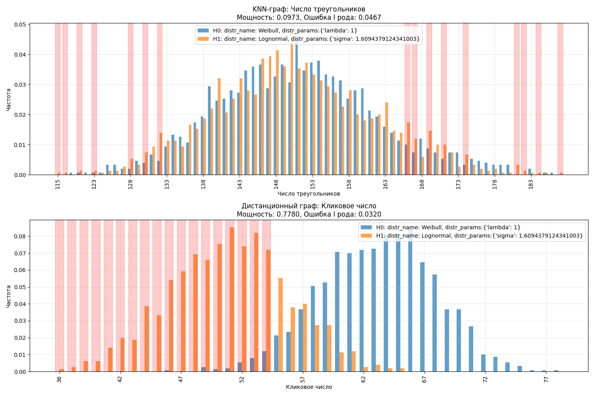

# Отчёт по части I

## Отчёт Аскара

### Часть 1. Зависимость от параметров распределений
Значения на графиках — среднее по $M = 100$ независимым реализациям для каждого набора параметров. Число вершин графа $n = 100$, параметр $k = 5$ для kNN-графа и порог $d = 1$ для DIST-графа.

1. **kNN-граф:** среднее число компонент связности практически не зависит от параметра $\alpha$ SkewNormal (почти горизонтальная кривая около $6$–$6.5$). Для Student-t с ростом $\nu$ число компонент убывает, то есть при «тяжёлых хвостах» (меньшее $\nu$) граф рассоединён сильнее.  
2. **DIST-граф:** среднее кликовое число минимально при $\alpha = 0$ и симметрично растёт при удалении от нуля (от $\sim 40$ до $\sim 70$). Для Student-t кликовое число увеличивается с $\nu$ (от $\sim 30$ при $\nu \approx 1$ до $\sim 40$–$45$ при $\nu \approx 10$).

---

### Часть 2. Зависимость от $n$, $k$ и $d$
Значения на графиках — среднее по $M = 100$ независимым реализациям для каждого набора параметров.

- **kNN-граф:**
  - При увеличении числа вершин $n$ (при $\alpha = \alpha_0$, $\nu = \nu_0$, $k = 5$) среднее число компонент связности возрастает.
  - При увеличении числа соседей $k$ (при $\alpha = \alpha_0$, $\nu = \nu_0$, $n = 100$) число компонент резко убывает.
- **DIST-граф:**
  - При увеличении числа вершин $n$ (при $\alpha = \alpha_0$, $\nu = \nu_0$, $d = 1$) среднее кликовое число растёт, причём скорость роста выше для SkewNormal-графов.
  - При увеличении $d$ (при $\alpha = \alpha_0$, $\nu = \nu_0$, $n = 100$) кликовое число также увеличивается, и для SkewNormal-графов этот рост быстрее. Рост вызван тем, что точки чаще попадают в радиус $d$.

---

### Часть 3. Разделяющая способность статистик
Построено по $M_{\text{large}} = 5000$ реализаций каждого распределения.

- **kNN-граф:** распределения числа компонент при $H_0$ и $H_1$ сильно перекрываются — низкая разделяющая способность, мощность маленькая.  
- **DIST-граф:** распределения кликового числа сдвинуты друг от друга: для SkewNormal пик около 50, для Student-t — около 39. Красная зона — область принятия $H_1$: мощность выше.

---

## Отчёт Ярослава

### Часть 1. Влияние параметров распределений
Среднее по $M = 100$ реализациям, $n = 100$, $k = 5$ (kNN) / $d = 1$ (DIST).

1. **kNN-граф:** число треугольников почти не меняется при изменении $\lambda$ Weibull (около $150$–$151$); при увеличении дисперсии $\sigma$ у Lognormal падает с $151$ до $91$.  
2. **DIST-граф:** кликовое число уменьшилось с $62$ до $27$ при росте $\lambda$ (Weibull) и с $55$ до $50$ при росте $\sigma$ (Lognormal).

---

### Часть 2. Зависимость от $n$, $k$ и $d$

---

### Выводы
1. Для метрики «треугольники» оба распределения ведут себя почти одинаково — выбор распределения практически не влияет на итог.  
2. Для «кликового числа» Weibull формирует более плотные графы: прирост относительно Lognormal усиливается с ростом $n$ и $d$.  
3. **Чувствительность метрик:**  
   - «Треугольники» — сильнее реагируют на увеличение $k$ (приблизительно $\propto k^{3}$), чем на $n$ (приблизительно $\propto n$).  
   - «Клики» — линейны по $n$, но по $d$ быстро достигают плато.

---

### Часть 3. Проверка статистических гипотез

- Мощность теста по треугольникам (kNN) составляет $0.1$ при ошибке I рода $0.05$.  
- Мощность теста по кликовому числу (DIST) — $0.78$ при ошибке $0.03$.
